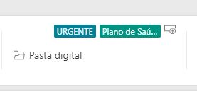
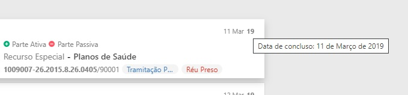
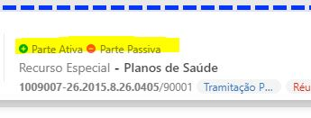

# Accessibility step-by-step

 

1. [leitor de tela](#1)
    1.2. [Instalação e configuração ](#1-1)
    1.3. [Navegação](#1.3)


## <a name="1-1">#</a> 1.1 Leitor de tela
 - [Windows](https://www.nvaccess.org/download/) 
 - Linux: 
 - MacOS:  

 Atualizar NVDA:   
 Realçar foco:   

## <a name="1-2">#</a> 1.2 Como funciona a navegação com leitor de telas 
Comparação de uso em [prototype master](http://ux-lab.softplan.com.br/testeAcessibilidade/tutorial/start/) e [prototype master acessível](http://ux-lab.softplan.com.br/testeAcessibilidade/prototype/)

- h: navegação por títulos
- d: navegação por áreas 
- f: navegação por formulários 
- t: navegação por tabelas 
- insert+M: ligar/desligar o rastreio do mouse
- insert+s: Pausar a fala
- insert+space: alternar modo de foco e navegação
- inser+n instalar complementos 


[Documentação - Guia de navagação NVDA](https://www.nvaccess.org/files/nvda/documentation/userGuide.html?)

 

## <a name="1-3">#</a> 1.3 Clonar aplicação
A idéia é ter uma aplicação base para melhorar a semantica e aplicar acessibilidade, vamos utilizar o prototype.  
```shell
$ git clone git@git-unj.softplan.com.br:uxunj/prototype.git  
```

```shell
$ npm config set registry https://artifactory.softplan.com.br/artifactory/api/npm/npm/
$ npm config set always-auth=true
$ npm login
```

```shell
$ git checkout -b acessibilidade-master
$ npm install 
$ npm start 
$ code .
```
 Clone, checkout, install, start:   

 
#### 1.3 Aplicação
 Preview da aplicação:   
 
- Deixar a aplicação lang="pt-br"
- Titulo da aplicação: Gabinete | SAJ6
- Identificar blocos/áreas da aplicação

 Identificar blocos/áreas da aplicação:   

  

Identificamos

 - cabeçalho
 - sidebar
 - busca
 - lista de processos
 - etiquetas 


#### O que podemos fazer?
- Aplicar tag html corretamente, e adicionar role="region" caso precise deixar os blocos semanticos
- Implementar skip-to 

 
##### Header 
 path: src>blocks>header>index.js
```html 
<HeaderBlock 
    aria-label="Cabeçalho"
    id="header">
```

```css
const HeaderBlock = styled.header`
```


##### Sidebar 
 path: src>blocks>sidebar>index.js
```html 
<SideBar 
    aria-label="Sidebar"
    id="sidebar"
```

```css
const SideBar = styled.aside`
```
 
##### Busca 
 path: src>blocks>subHeader>index.js
```html 
<InputWrapper 
    role="search"
    aria-label="Busca de processos"
    id="searchProcessos">
```
    
##### Principal 
 path: src>blocks>container>index.js
```html 
 <CardListWrap id="listaDeProcessos">
```

```css
const CardListWrap = styled.main`
```
 


#### Implementação do Skip-to

Agora que já mapeamos e deixamos as regioes semanticas, podemos adicionar um skip-to para fazer os saltos para cada região.

 path: src>blocks>header>index.js
```jsx 
 <Wrapper>
    <Skip role="region" aria-label="Atalhos:" tabIndex='1'>
        <a href="#header">Pular para Cabeçalho </a>
        <a href="#sidebar">Pular para Sidebar </a>
        <a href="#searchProcessos">Pular para busca de processos</a>
        <a href="#listaDeProcessos">Pular para lista de processos</a>
    </Skip>
```
```scss
const Skip = styled.div`  
    display: flex;
    align-content: center;
    align-items: center;
    margin-left: 20px;

      a{
        position:absolute;
      left:-10000px;
      top:auto;
      width:1px;
      height:1px;
        overflow:hidden; 
    
      &:focus{ 
        position:static;
        width:auto;
        height:auto;
          color: #fff;
      
        }
      }  
`

```


#### Recolher e expandir menu

 O atributo semântico usado é o ***aria-expanded={true/false}***  
 link de referência: https://www.w3.org/WAI/GL/wiki/Using_aria-expanded_to_indicate_the_state_of_a_collapsible_element


 como aplicar

 ```jsx 
 const [expanded, setExpanded] = useState(false);
 function handleExpandClick(event) {
    setExpanded(!expanded);
  } 
 ```


 ```jsx 
    <button onClick={event => handleExpandClick(event)} aria-expanded={!expanded}>
        <span>
            {!expanded
              ? "Reconher Menu" 
              : "Expandir Menu"
            }
         </span> 
    </button> 

 ```


 path: src>blocks>sidebar>componentes>collapse>index.js


```jsx
{!context.sidebarCollapse &&
          <Typography size="12" weight="semibold" color="neutralPrimary">Processos</Typography>
        } 

        <Tooltip
          placement="right"
          label={`${!context.sidebarCollapse ? "click para recolher sidebar" : "Click para e  expandir sidebar"} `}
          aria-expanded={!context.sidebarCollapse} >
          <ButtonCollapse
            onClick={() => context.setSidebarCollapse(!context.sidebarCollapse)} 
            //aria-label={`${!context.sidebarCollapse ? "click para recolher sidebar" : "Click para e  expandir sidebar"} `}
            collapse={context.sidebarCollapse}
            aria-expanded={!context.sidebarCollapse}> 
            {context.sidebarCollapse
              ? <Icon size="8" fill={colors.neutralSecondary}>AngleDoubleRight</Icon>
              : <Icon size="8" fill={colors.neutralSecondary}>AngleDoubleLeft</Icon>
            }
          </ButtonCollapse>
        </Tooltip>  
```


#### Lista de processos

A semantica correta de uma lista é 

```css
<ul>
    <li> item de processo ...
```
Precisamos adicionar um h2 para navegação via teclado

path: src>blocks>container>index.js

```jsx
<CardListWrap id="listaDeProcessos">
        <h2 class="sr-only">Lista de processos</h2>
```

```jsx
<ul style={{ listStyle: 'none', padding: '0', margin: '0' }}>
    {context.cards.map((data, index) => (
        <CardContextProvider value={{ data, index }} key={`cardContext${data.id}`}> 
            <Card data={data} index={(index + 1)} key={`cardContext${data.id}`} /> 
        </CardContextProvider>
    ))}
</ul>
```

path: src>template>card>index.js
```jsx
const CardWrapper = styled.li`
```

##### Adicionar class global "somente para leitores de tela"
   
Precisamos adicionar um css global para que toda vez que usarmos uma class .sr-only o elemente fica disponivel somente pare leitores de tela, pois, ainda está na arvore DOM

path: src>config>App>index.js

``` jsx
import { createGlobalStyle } from 'styled-components';
```

criar o estilo do meu css global, aqui forçamos o uso da fonte padrão e a definição do .sr-onl

``` jsx
const GlobalStyle = createGlobalStyle`
  body{
    font-family: "Segoe UI Semibold", "Segoe UI", "Selawik Semibold", Tahoma, Verdana, Arial, "sans-serif !default";
  }
  .sr-only {
      position: absolute !important;
      left: -10000px !important;
      width: 1px !important;
      height: 1px !important;
      overflow: hidden !important;
  }
`
```

Adicionar a tag do componente <GlobalStyle /> para que fique visível em toda aplicação.

``` jsx
    ... 
    <GlobalStyle />
</BrowserRouter>
...
```

 
 
### Componente de Card

#### Um card é composto por tres componentes

- checkbox
- titulo
- card

#### dividido em três regiões

Atividades | Documentos | Dados do processo
------------ | ------------- | -------------
alguma ação | tags, documento e arquivos | informações relevantes
 

path: src>template>card>index.js

```html
<Grid ... role="region" aria-label="Atividades">
    <LeftBlock />
</Grid>

<Grid ... role="region" aria-label="Documentos">
    <MidBlock />
</Grid>

<Grid ... role="region" aria-label="Dados do Processo">
    <RightBlock />
</Grid>
```               
 

 #### Checkbox
 Adicionar aria-label no checkbox pois no Djaws a leitura fica confusa

```html
<Checkbox aria-label="Ação em lote" checked={data.checked} />
```


#### Card 

transformar o Card em um componente focável pra isso é necessário adicionar um atributo tabindex="-1"e componente de styled

```html
<SCard
   tabindex="-1" 
```

```jsx
const SCard = styled(Card)`
  border: 1px solid transparent;

  &:focus{
    box-shadow: 0 0 0 3px rgba(121,82,179,.25);
    outline-color: rgba(121,82,179,.25);
    outline-width: 1px;
    outline-style: dotted;
  }

  &:focus-within {
    box-shadow: 0 0 0 3px rgba(121,82,179,.25);
    border: 1px solid rgba(121,82,179,.25);
  } 
`
```


#### Titulo
A ideia é navegar de forma mais rápida usando somente a tecla h, que faz saltos em cada card, falando somente os pontos mais relevantes conforme o modelo de negócio de cada produto.


```html
 <h3 class="sr-only"> [tarjas] [partes] [assunto] </h3>
```


### Região Atividades
- abrir editor (active panel)

```jsx
<PreContent onClick={() => (context.data.started ? "" : context.callActionPanel())} started={context.data.started}>
          <SearchIcon aria-hidden="true">
            <Icon children="Search" />
          </SearchIcon>

          <InfoWrap> 
            <span className="sr-only">Clique para: </span>
            <Typography
              noWrap
              size={14}
              color="neutralSecondaryAlt"
              title={isNil(context.modelo) ? "Despacho" : context.model.categoria}
            >
              {isNil(context.modelo) ? "Despacho" : context.model.categoria}
            </Typography>

            <Typography
              noWrap
              size={14}
              weight="semibold"
              color="neutralPrimary"
              title={`Clique para:  ${isNil(context.model) ? "Elaborar Documento" : context.model.nome}`}
              aria-label={`Clique para:  ${isNil(context.model) ? "Elaborar Documento" : context.model.nome}`}
            >
              {isNil(context.model) ? "Elaborar Documento" : context.model.nome}
            </Typography>
          </InfoWrap>

          {context.data.started
                                && (
                                <Button aria-label="clique para continuar edição" size="medium" variant="primary" onClick={() => context.callActionPanel()}>
                                  Continuar
                                </Button>
                                )}

          <LineRight />
        </PreContent>
```


### Região documentos
- lista de tags
- links para pasta digital e outros documentos

#### List de tags 

  

```jsx
<TagsWrapp> 
    <Tags>
        <ul className="tags-list" aria-label="Lista de tags" >
            {context.bindedTags.length > 0
            && context.bindedTags.map((item) => (
                <li>
                    <Tag
                    key={item.id}
                    color={item.background}
                    label={item.name}
                    />
                </li>
            ))}
        </ul>
    </Tags>
    ...
```
```jsx
const TagsWrapp = styled.section`
    ... 
    .tags-list{
      list-style:none; 
     display: flex;
    }
`;
```

##### links para pasta digital e outros documentos

```jsx
 <FolderWrapp>
    {/* Link para pasta digital */}
    <a  
    href={`http://ux-lab.softplan.com.br/pastadigital/v3.2--SG/${digitalFolder.url}`}
    target="_blank"
    rel="noopener noreferrer"
    aria-label="Abrir em outra página: Pasta digital"
    >
    <Icon aria-hidden="true"  children="Folder" />
    <Typography size={14} color="neutralPrimary">Pasta digital</Typography>
    </a>
</FolderWrapp>
```


### Região dados do processo
- data de concluso
- lista de partes
- classe e assunto
- número do processo
- lista de tarjas

##### Data de concluso


  

```html
<DateLine title={`Data de concluso: ${moment(context.data.data).format('D [de] MMMM')} ${moment(context.data.data).format('[de] YYYY')} `}>
    <Typography aria-hidden="true" size={11} color="neutralSecondaryAlt" component="span">
        <span class="sr-only">Data de concluso: &nbsp; {moment(context.data.data).format('D [de] MMMM')} {moment(context.data.data).format('[de] YYYY')} </span>
        <span aria-hidden="true"> {moment(context.data.data).format('D MMM')}</span>
    </Typography> &nbsp;
    <Typography aria-hidden="true" size={11} weight="bold" color="neutralSecondaryAlt" component="span">{moment(context.data.data).format("YY")}</Typography>
</DateLine>
```


##### Lista de partes
  

Visualmente são dois elementos, pode ter até uma terceira parte, o magistrado, dessa forma temos uma lista, então precisamos colocar na semântica correta, ou seja, ul>li 
o icone em svg pode ser escondido com um aria-hidden="true"

```jsx
 <ul aria-label="Lista de partes">
    <li>
        <Icon aria-hidden="true" size={10} children="Positive" />
        <span class="sr-only">Parte ativa: &nbsp; </span>
        <Typography title="Parte ativa" size={12} color="neutralSecondaryAlt" component="span">
            {context.data.partes && context.data.partes.ativa.name}
        </Typography>
    </li>
    <li>
        <Icon size={10} children="Negative" />
        <span class="sr-only">Parte Passiva: &nbsp; </span>
        <Typography size={12} color="neutralSecondaryAlt" component="span">
            {context.data.partes && context.data.partes.passiva.name}
        </Typography>
    </li>
</ul>
```
```scss

 ul{ 
    list-style: none;
    margin: 0;
    padding: 0;
    display: flex;
        li{ padding-right: 10px;
            svg{ margin-right: 3px }
        } 
}

// span{
//     white-space: nowrap;
//     overflow: hidden;
//     text-overflow: ellipsis;
// }

```


##### classe e assunto
```jsx
 <Typography 
    title={`Classe: ${context.data.classe}`} 
    size={14} 
    color="neutralSecondaryAlt" 
    component="span">
     <span class="sr-only">Classe:</span> {context.data.classe}
</Typography>
     <span aria-hidden="true" >  &nbsp;-&nbsp; </span>
<Typography 
    title={`Assunto: ${context.data.assunto}`} 
    size={14} 
    color="neutralSecondary" 
    weight="semibold" 
    component="span"><span class="sr-only">Assunto:</span> {context.data.assunto}
</Typography>
          
```


#### número do processo
```jsx
<Numero title={`Número do processo: ${number[0]}`} >
    <Typography size={12} color="neutralSecondaryAlt" weight="bold" component="span">
        <span class="sr-only">Número do processo: &nbsp; </span> {number[0]}
    </Typography> 
    <Typography size={12} color="neutralSecondaryAlt" component="span">
        /  {number[1]}
    </Typography> 
</Numero>

```
```jsx
const Numero = styled.div`
    margin-right: 6px;
    display: inherit;
` 
```

#### Tarjas  
```jsx
<TarjaLista aria-label="Lista de tarjas">
    {context.bindedTarjas
        && context.bindedTarjas.map((tarja, index) => (
            <li>
            <Stamp
                key={index}
                label={tarja.name}
                textColor={tarja.color}
                backgroundColor={tarja.background}
            />
            </li>
        )
    )}
</TarjaLista>
```

```jsx
const TarjaLista = styled.ul`
  list-style: none;
  padding: 0;
  margin: 0;
  li {
    padding-right: 0px !important;
  }
`;
```


## <a name="1-6">#</a> 1.6 Teste automatizado 
Mostrar o uso do LightHouse


 


